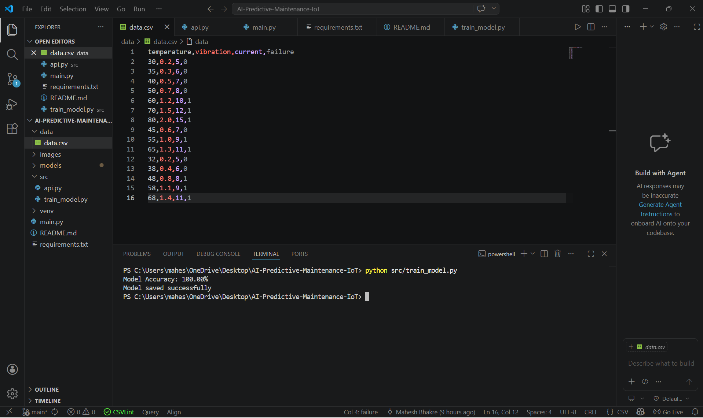
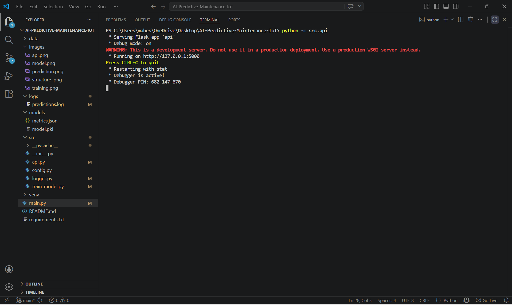
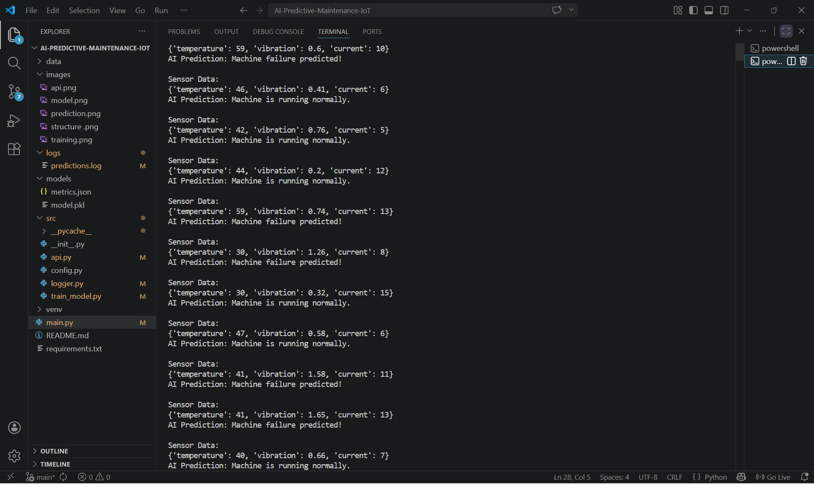
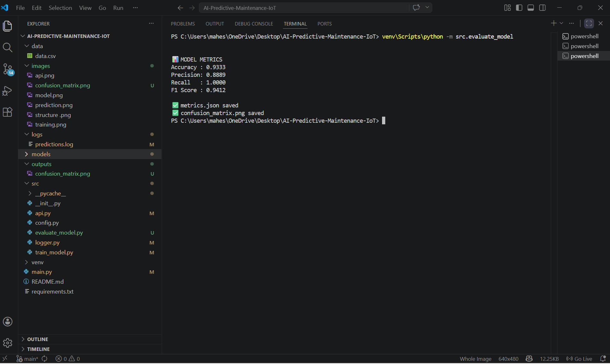
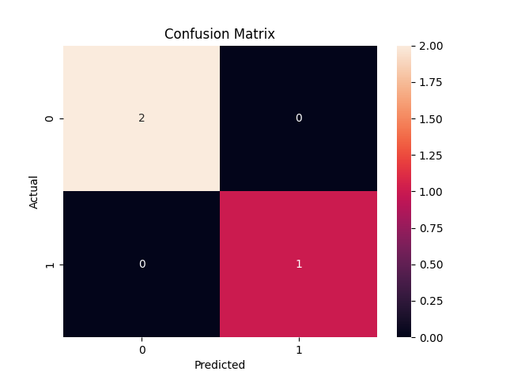
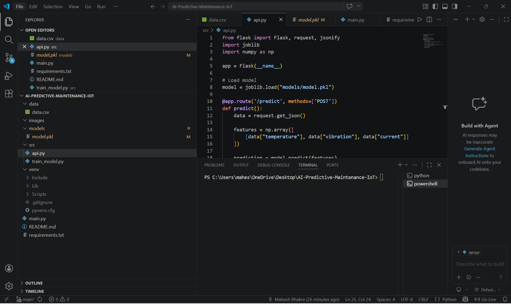

# 🤖 AI-Powered Predictive Maintenance System for IoT Devices


---

## 📌 Overview

This project implements an **AI-powered predictive maintenance system** using simulated IoT sensor data.

The system predicts **machine failures before they occur**, enabling:

* proactive maintenance
* reduced downtime
* cost optimization

---

## 🛠 Problem Statement

Traditional maintenance systems are:

* Reactive (fix after failure)
* Expensive
* Inefficient

---

## ✅ Solution

This system provides:

* Early failure detection
* Real-time predictions using API
* Automated decision logic
* Logging for monitoring

---

## 🏭 Industry Relevance

| Industry      | Application                 |
| ------------- | --------------------------- |
| Manufacturing | Motor overheating detection |
| Factories     | Conveyor monitoring         |
| Power Plants  | Turbine failure prediction  |
| Automotive    | Engine fault detection      |
| Aviation      | Aircraft health monitoring  |

---

## 📊 Impact

* 🔻 5–10% reduction in maintenance cost
* ⏱ 15% reduction in downtime
* 📈 5–20% increase in productivity

---

## ⚙ Tech Stack

* **Language:** Python
* **Data Processing:** Pandas, NumPy
* **Machine Learning:** Scikit-learn (Random Forest)
* **API:** Flask
* **Visualization:** Matplotlib, Seaborn
* **Model Storage:** Joblib

---

## 📊 Dataset

Simulated IoT sensor dataset (CSV)

### Features:

* Temperature
* Vibration
* Current

### Target:

* `failure` → (0 = Normal, 1 = Failure)

---

## 🏗 System Architecture

Sensor Data → Preprocessing → ML Model → Prediction → API → Logging → Visualization

---

## 📁 Project Structure

```
AI-PREDICTIVE-MAINTENANCE-IOT/
├── data/
│   └── data.csv
├── images/
│   ├── api_running.png
│   ├── confusion_matrix.png
│   ├── metrics.png
│   ├── prediction_output.png
│   ├── structure.png
│   └── training.png
├── logs/
│   └── predictions.log
├── models/
│   ├── metrics.json
│   └── model.pkl
├── outputs/
│   └── confusion_matrix.png
├── src/
│   ├── __pycache__/
│   ├── __init__.py
│   ├── api.py
│   ├── config.py
│   ├── evaluate_model.py
│   ├── logger.py
│   └── train_model.py
├── venv/
├── main.py
├── README.md
└── requirements.txt
```

---

## ⚙ Installation & Setup

```bash
git clone https://github.com/maheshbhakre/AI-Predictive-Maintenance-IoT.git
cd AI-Predictive-Maintenance-IoT

python -m venv venv

# Activate (Windows)
venv\Scripts\activate

# Install dependencies
pip install -r requirements.txt
```

---

## 🖥 Usage

### 1️⃣ Train Model

```bash
python -m src.train_model
```

### 2️⃣ Run Evaluation (Metrics + Confusion Matrix)

```bash
python -m src.evaluate_model
```

### 3️⃣ Start API

```bash
python -m src.api
```

### 4️⃣ Run Simulation

```bash
python main.py
```

---

## 🔄 Real-Time Output

```
Sensor Data:
Temp=73, Vibration=0.52, Current=11
AI Prediction: FAILURE

Sensor Data:
Temp=30, Vibration=0.38, Current=5
AI Prediction: NORMAL
```

---

## 📊 Model Performance

```
Accuracy  : 0.9333
Precision : 0.8889
Recall    : 1.0000
F1 Score  : 0.9412
```

### ✅ Additional Validation

* Cross Validation Score: ~0.86
* Confusion Matrix generated

---

## 📁 Output Files

* `models/model.pkl` → trained model
* `models/metrics.json` → performance metrics
* `logs/predictions.log` → real-time logs
* `images/confusion_matrix.png` → confusion matrix

---

## 📸 Screenshots

### 🔹 Training



### 🔹 API Running



### 🔹 Prediction Output



### 🔹 Metrics



### 🔹 Confusion Matrix



### 🔹 Project Structure



---

## 🧠 Learning Outcomes

* Machine Learning pipeline
* Model evaluation (Accuracy, Precision, Recall, F1)
* API development using Flask
* Real-time prediction system
* Logging system implementation

---

## 🚀 Future Improvements

* Time-series models (LSTM)
* Real IoT hardware integration
* Cloud deployment (AWS / Azure)
* Dashboard (Streamlit / React)

---

## 👨‍💻 Author

Student Project – Built for:

* 💼 Placements
* 🎯 Internships
* 📊 Portfolio

---

## ⭐ Support

If you find this useful:

* Star ⭐ the repository
* Fork 🍴 and improve it

---
