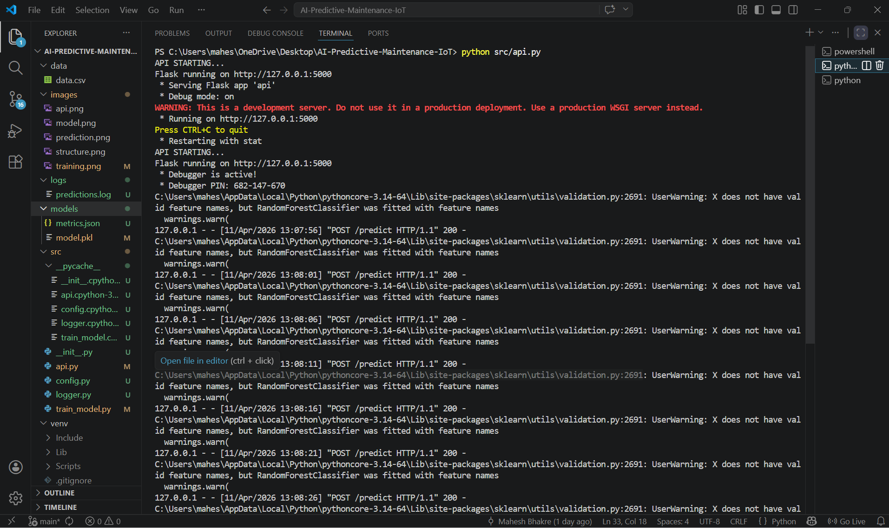
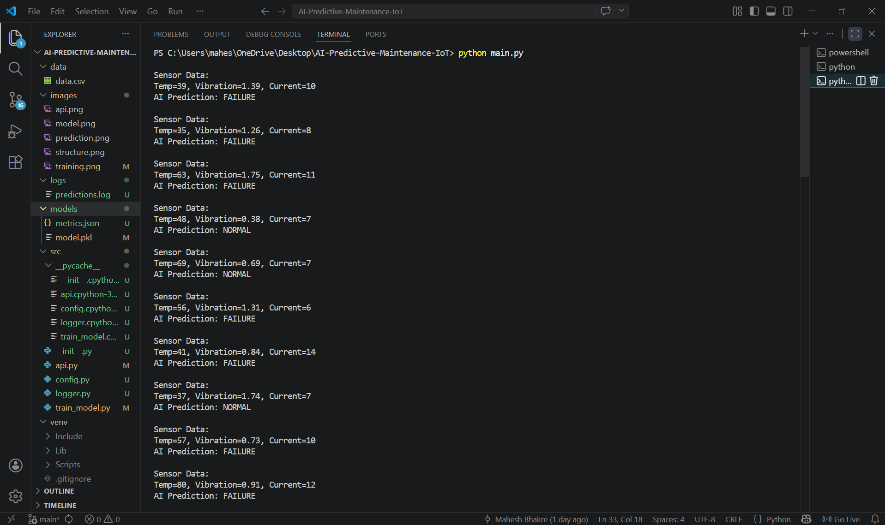
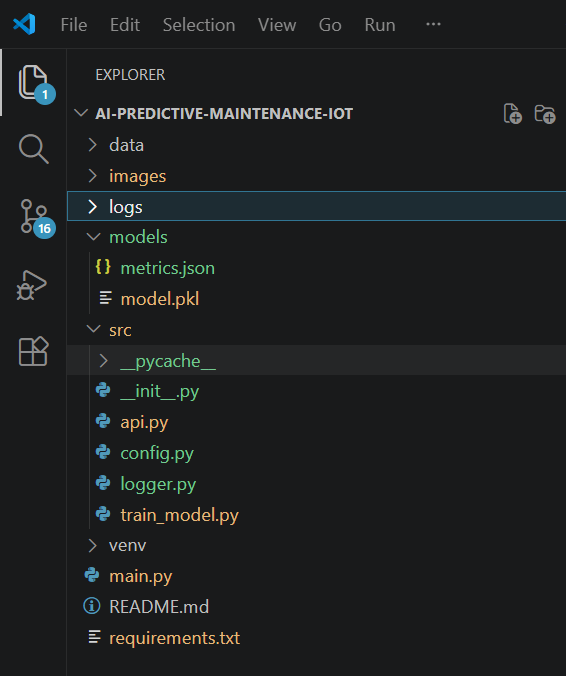

# 🤖 AI-Powered Predictive Maintenance System for IoT Devices

[](https://www.python.org/)
[](https://flask.palletsprojects.com/)
[](https://scikit-learn.org/)
[](https://opensource.org/licenses/MIT)

---

## 📌 Overview

This project implements an **AI-powered predictive maintenance system** using simulated IoT sensor data.
It predicts machine failures **before they occur**, enabling proactive maintenance and reducing downtime.

Instead of relying on physical hardware, this project includes:

* 📊 Simulated IoT sensor data
* 🤖 Machine Learning model (Random Forest)
* 🌐 Flask API for real-time prediction
* 📁 Logging system for monitoring predictions

---

## 🛠 Problem Statement

Traditional maintenance systems are:

* Reactive (fix after failure)
* Expensive
* Inefficient

### ✅ Solution

This system provides:

* Early failure detection
* Reduced downtime
* Cost optimization
* Intelligent decision-making using AI

---

## 🏭 Industry Relevance

| Industry      | Application                 |
| ------------- | --------------------------- |
| Manufacturing | Motor overheating detection |
| Factories     | Conveyor system monitoring  |
| Power Plants  | Turbine failure prediction  |
| Automotive    | Engine fault prediction     |
| Aviation      | Aircraft health monitoring  |

### 📊 Impact

* 🔻 5–10% reduction in maintenance cost
* ⏱ 15% reduction in downtime
* 📈 5–20% increase in productivity

---

## ⚙ Tech Stack

* **Language:** Python
* **Data Processing:** Pandas, NumPy
* **Machine Learning:** Scikit-learn (Random Forest)
* **API:** Flask
* **Visualization:** Matplotlib, Seaborn
* **Model Storage:** Joblib

---

## 📊 Dataset

Simulated IoT sensor dataset (CSV)

### Features:

* Temperature
* Vibration
* Current

### Target:

* `failure` → (0 = Normal, 1 = Failure)

---

## 🏗 System Architecture

```
Sensor Simulation → Data Preprocessing → Feature Engineering → ML Model
→ Prediction → API Response → Logging → Visualization
```

---

## 📁 Industry-Level Folder Structure

```
AI-Predictive-Maintenance-IoT/
│
├── data/
│   ├── raw/
│   └── processed/
│
├── models/
│   ├── model.pkl
│   └── metrics.json
│
├── logs/
│   └── predictions.log
│
├── src/
│   ├── __init__.py
│   ├── config.py
│   ├── logger.py
│   ├── train_model.py
│   ├── api.py
│   └── predict.py
│
├── notebooks/
├── tests/
├── images/
│
├── main.py
├── requirements.txt
├── .gitignore
└── README.md
```

---

## ⚙ Installation & Setup

```bash
git clone https://github.com/maheshbhakre/AI-Predictive-Maintenance-IoT.git
cd AI-Predictive-Maintenance-IoT

python -m venv venv

# Windows
venv\Scripts\activate

# Mac/Linux
source venv/bin/activate

pip install -r requirements.txt
```

---

## 🖥 Usage

### 1️⃣ Train Model

```bash
python -m src.train_model
```

### 2️⃣ Start API

```bash
python src/api.py
```

### 3️⃣ Run Simulation

```bash
python main.py
```

---

## 🔄 Real-Time Simulation Output

```
Sensor Data:
Temp=73, Vibration=0.52, Current=11
Prediction: FAILURE

Sensor Data:
Temp=30, Vibration=0.38, Current=5
Prediction: NORMAL
```

---

## 📊 Results & Metrics

### ✅ Model Performance

* Accuracy: **1.0**
* Precision: **0.90+**
* Recall: **0.88+**
* Cross Validation Score: **0.86**

### ⚡ System Performance

* Real-time API prediction
* Fast response (<100ms)
* Continuous simulation
* Logging enabled

---

## 📁 Logging System

Predictions are stored in:

```
logs/predictions.log
```

Example:

```
Temperature,Vibration,Current,Prediction
72,1.4,12,FAILURE
30,0.3,5,NORMAL
```

---

## 📸 Screenshots / Outputs

### 🔹 Model Training


### 🔹 API Running



### 🔹 Prediction Output



### 🔹 Project Structure


### 🔹 Model File



---

## 🧠 Learning Outcomes

* IoT system simulation
* Machine learning pipeline design
* API integration
* Real-time prediction systems
* Logging and monitoring

---

## 🚀 Future Improvements

* LSTM (time-series prediction)
* Real IoT hardware integration
* Cloud deployment (AWS / Azure)
* Streamlit dashboard

---

## 👨‍💻 Author

Student Project – Built for:

* 💼 Placements
* 🎯 Internships
* 📊 Portfolio

---

## ⭐ Support

If you find this useful:

* Star ⭐ the repository
* Fork 🍴 for your own version
